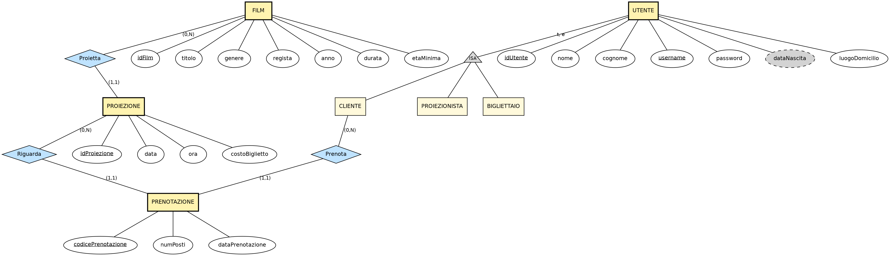
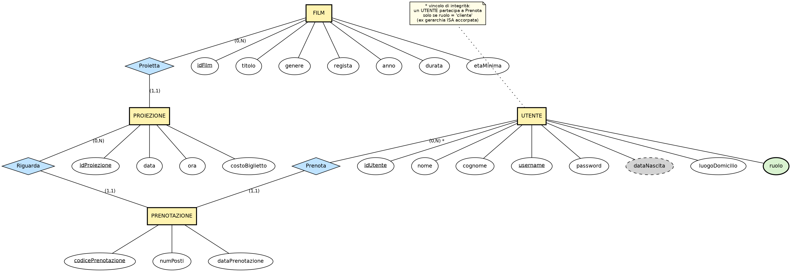

# CineMax — Progettazione del Database

Laboratorio Interdisciplinare B — a.a. 2025/2026
Documento di progettazione concettuale e logica del database `dbCM`

---

## 1. Analisi dei requisiti (ristrutturata)

Dalle specifiche di progetto sono stati estratti e riorganizzati i seguenti requisiti relativi ai dati (si tralasciano, in questa fase, i requisiti puramente funzionali/applicativi già descritti nel documento di specifica).

### 1.1 Film

- Il sistema deve gestire un catalogo di **film**, ciascuno caratterizzato da: titolo, genere, regista, anno di uscita, durata, età minima consigliata per il pubblico.
- Un film può essere inserito dal proiezionista indipendentemente dalle proiezioni ad esso associate (un film può non avere ancora alcuna proiezione programmata).
- Un film può comparire in più proiezioni (in giorni/orari diversi).

### 1.2 Proiezioni (palinsesto)

- Ogni **proiezione** riguarda esattamente un film, in una data e un orario specifici, con un costo del biglietto associato.
- Il cinema è **monosala** con capienza fissa di **200 posti**: tale valore è un vincolo di dominio della sala, non richiede una entità dedicata (non esistono più sale).
- Due proiezioni non possono sovrapporsi nel tempo (stessa sala, stesso intervallo [inizio, inizio+durata) su date/orari in conflitto). *Vincolo inter-istanza, non esprimibile graficamente in ER: viene documentato in linguaggio naturale e implementato a livello di base di dati/applicazione.*
- Una proiezione può essere modificata (cambio data) o eliminata **solo se non esistono prenotazioni** ad essa associate.
- Il numero di posti liberi per una proiezione è un dato **derivato**: capienza sala (200) meno la somma dei posti prenotati per quella proiezione.

### 1.3 Utenti

- Il sistema distingue tre tipologie di utenti registrati, tutte modellate in un'unica tabella `Utenti` (vincolo esplicito di specifica): **clienti**, **proiezionisti**, **bigliettai**.
- Ogni utente ha: nome, cognome, username (univoco, usato per il login), password (memorizzata cifrata), data di nascita (facoltativa), luogo di domicilio, ruolo.
- La base dati deve contenere, già popolata, **2 proiezionisti** e **5 bigliettai**.
- Solo i **clienti** possono effettuare prenotazioni; proiezionisti e bigliettai non partecipano alla gestione delle prenotazioni proprie (i bigliettai le consultano, i proiezionisti gestiscono il palinsesto).
- Un utente non registrato (ospite) può cercare/visualizzare proiezioni e registrarsi come cliente, ma non può prenotare.

### 1.4 Prenotazioni

- Un **cliente registrato** può prenotare uno o più posti per una proiezione, a patto che il numero di posti richiesti sia **minore** del numero di posti disponibili in quel momento.
- Alla creazione di una prenotazione viene generato un **codice univoco** che la identifica (usato anche dai bigliettai per la ricerca).
- Una prenotazione può essere modificata (cambio data/proiezione) solo se sia la vecchia sia la nuova data di proiezione sono **successive alla data odierna**.
- Una prenotazione può essere cancellata dal cliente secondo la condizione descritta a specifica (proiezione con data **precedente** alla data odierna — *si segnala che tale condizione appare invertita rispetto alla logica applicativa attesa: normalmente si annulla una prenotazione futura, non una già trascorsa; il vincolo, essendo puramente temporale, non incide sullo schema del database ma solo sulla logica applicativa, e viene riportato qui letteralmente come da specifica, da verificare con il docente*).
- Il costo di una prenotazione è dato da: costo unitario del biglietto (quello della proiezione) × numero di posti prenotati. Non è necessario memorizzarlo come attributo ridondante: una proiezione con prenotazioni associate non può più essere modificata (vedi 1.2), quindi il costo unitario resta stabile e il totale è sempre calcolabile.
- Un bigliettaio può cercare prenotazioni per codice, per nome/cognome cliente, per titolo film (anche parziale), per intervallo di date.

### 1.5 Fonte dati iniziale

- Il docente fornisce un file `proiezioni.csv` con dati di partenza su film e proiezioni, da importare nel database (vedi §6, script di popolamento).

---

## 2. Schema concettuale Entità-Relazione (E-R)

Si adotta la notazione classica (Chen), con generalizzazione/specializzazione per modellare le tre tipologie di utente. Il diagramma è in `er_concettuale.png` (§5).

### 2.1 Entità e attributi

**FILM**
- `idFilm` (chiave primaria)
- titolo, genere, regista, anno, durata, etaMinima

**PROIEZIONE**
- `idProiezione` (chiave primaria)
- data, ora, costoBiglietto

**UTENTE** (entità padre della gerarchia)
- `idUtente` (chiave primaria)
- nome, cognome, `username` (chiave alternativa), password, dataNascita (opzionale), luogoDomicilio

Specializzazione **totale ed esclusiva** (ogni utente è di uno ed un solo tipo):
- **CLIENTE** — nessun attributo aggiuntivo
- **PROIEZIONISTA** — nessun attributo aggiuntivo
- **BIGLIETTAIO** — nessun attributo aggiuntivo

*(i tre ruoli non hanno attributi propri distinti nelle specifiche: la distinzione è puramente comportamentale/di permessi. La gerarchia viene comunque modellata concettualmente per chiarezza semantica, e sarà accorpata nella fase di ristrutturazione — vedi §3.)*

**PRENOTAZIONE**
- `codicePrenotazione` (chiave primaria, generato dal sistema)
- numPosti, dataPrenotazione (istante di creazione, per tracciabilità)

### 2.2 Relazioni e cardinalità

| Relazione | Entità coinvolte | Cardinalità | Significato |
|---|---|---|---|
| **Proietta** | FILM (0,N) — PROIEZIONE (1,1) | un film ha 0 o più proiezioni; ogni proiezione riguarda esattamente un film |
| **Prenota** | CLIENTE (0,N) — PRENOTAZIONE (1,1) | un cliente ha 0 o più prenotazioni; ogni prenotazione è fatta da esattamente un cliente |
| **Riguarda** | PROIEZIONE (0,N) — PRENOTAZIONE (1,1) | una proiezione ha 0 o più prenotazioni; ogni prenotazione riguarda esattamente una proiezione |

### 2.3 Vincoli di integrità aggiuntivi (linguaggio naturale)

Non esprimibili graficamente nel modello E-R:

1. **Unicità username**: `Utente.username` deve essere univoco nell'intera base di dati.
2. **Non sovrapposizione proiezioni**: per ogni coppia di proiezioni P1, P2 con P1 ≠ P2, gli intervalli [data+ora, data+ora+durata(film)) non devono intersecarsi (sala unica).
3. **Capienza sala**: per ogni proiezione, la somma di `numPosti` delle prenotazioni ad essa associate non può superare 200.
4. **Coerenza temporale prenotazioni**: la creazione/modifica di una prenotazione richiede che la/e proiezione/i coinvolta/e sia/siano relative a date successive alla data odierna (si veda l'osservazione al punto 1.4 sull'eliminazione).
5. **Immutabilità proiezione con prenotazioni**: una proiezione con almeno una prenotazione associata non può essere modificata né eliminata.

---

## 3. Ristrutturazione dello schema E-R

Prima della traduzione verso lo schema logico si applicano le seguenti trasformazioni, motivandole:

### 3.1 Accorpamento della gerarchia UTENTE nell'entità padre

Le specifiche richiedono esplicitamente **un'unica tabella `Utenti`** contenente un attributo `ruolo` con dominio {cliente, proiezionista, bigliettaio} (vedi specifica, slide 6). Inoltre le sottoentità CLIENTE, PROIEZIONISTA e BIGLIETTAIO non possiedono attributi propri: non c'è quindi perdita di espressività nell'accorpare l'intera gerarchia nel padre UTENTE, aggiungendo l'attributo discriminante `ruolo`.

Questa è la tecnica standard di ristrutturazione "accorpamento delle entità figlie nel padre": si elimina la gerarchia e si sposta l'informazione di tipo in un attributo. Di conseguenza:

- L'entità UTENTE assorbe CLIENTE, PROIEZIONISTA, BIGLIETTAIO e guadagna l'attributo `ruolo` (obbligatorio, dominio ristretto).
- La relazione **Prenota**, che nello schema concettuale coinvolgeva la sola sottoentità CLIENTE, viene ridefinita tra UTENTE e PRENOTAZIONE, accompagnata dal seguente **vincolo di integrità aggiuntivo** (non più esprimibile graficamente, da imporre con un CHECK/trigger a livello di base dati e comunque validato a livello applicativo):

  > *Un'istanza di UTENTE partecipa alla relazione Prenota solo se il valore del proprio attributo `ruolo` è `'cliente'`.*

### 3.2 Verifica delle forme normali

Tutti gli attributi individuati sono atomici (nessun attributo multivalore o composto), e ogni entità ha una chiave primaria mono-attributo (surrogata, `id*`) o comunque non decomponibile: non sussistono quindi dipendenze parziali né transitive rispetto alle chiavi. Lo schema risultante è già in **Terza Forma Normale (3NF)**; non sono state rilevate ridondanze da eliminare (si veda anche la scelta di non memorizzare il costo totale della prenotazione come attributo derivato, §1.4).

### 3.3 Analisi delle ridondanze e dei dati derivati

- Il **numero di posti liberi** di una proiezione è un dato derivabile (200 − Σ posti prenotati) e non viene quindi materializzato come attributo, per evitare anomalie di aggiornamento.
- Il **costo totale** di una prenotazione è anch'esso derivabile (costoBiglietto × numPosti) e non viene materializzato, per lo stesso motivo (si ricorda che una proiezione con prenotazioni non è più modificabile, quindi il calcolo resta sempre corretto e stabile nel tempo).

### 3.4 Schema E-R ristrutturato (riepilogo)

Al termine della ristrutturazione lo schema è composto da 4 entità (FILM, PROIEZIONE, UTENTE, PRENOTAZIONE) e 3 relazioni binarie, tutte con cardinalità massima (1,1) da un lato — situazione ottimale per la traduzione verso lo schema relazionale (vedi §4). Il diagramma ristrutturato è in `er_ristrutturato.png` (§5).

---

## 4. Traduzione nello schema logico relazionale

Regola applicata: ogni relazione binaria in cui una delle due entità partecipa con cardinalità massima 1 (qui: sempre il lato "molti" verso "uno") viene tradotta **senza tabella separata**, aggiungendo una chiave esterna nella tabella corrispondente all'entità con cardinalità (1,1). Questo evita join aggiuntivi e tabelle ponte non necessarie, dato che nessuna delle tre relazioni ha cardinalità massima N su entrambi i lati.

### 4.1 Schema relazionale risultante

```
film(id_film, titolo, genere, regista, anno, durata_minuti, eta_minima)

proiezioni(id_proiezione, id_film → film, data_proiezione, ora_proiezione, costo_biglietto)

utenti(id_utente, nome, cognome, username, password_hash, data_nascita, luogo_domicilio, ruolo)

prenotazioni(codice_prenotazione, id_utente → utenti, id_proiezione → proiezioni,
             num_posti, data_prenotazione)
```

Legenda: sottolineate (qui in **grassetto concettuale**) le chiavi primarie `id_film`, `id_proiezione`, `id_utente`, `codice_prenotazione`; `→` indica chiave esterna (foreign key).

### 4.2 Motivazione delle scelte di traduzione

- **Proietta** (FILM 0,N — PROIEZIONE 1,1): la FK `id_film` va nella tabella `proiezioni` (lato con cardinalità massima 1), NOT NULL perché la partecipazione di PROIEZIONE è totale (1,1).
- **Prenota** (UTENTE 0,N — PRENOTAZIONE 1,1): la FK `id_utente` va nella tabella `prenotazioni`, NOT NULL. Il vincolo "solo utenti con ruolo = cliente" (§3.1) viene implementato con un **trigger** (non esprimibile con un semplice CHECK, perché richiede di leggere un'altra tabella) — vedi script SQL, §6.
- **Riguarda** (PROIEZIONE 0,N — PRENOTAZIONE 1,1): la FK `id_proiezione` va nella tabella `prenotazioni`, NOT NULL.
- Nessuna delle 4 entità richiede accorpamento reciproco (non ci sono relazioni 1:1 tra le entità stesse): lo schema resta con 4 tabelle distinte, tutte in 3NF, come previsto dalla traccia.
- `username` viene dichiarato `UNIQUE` (chiave alternativa individuata in fase concettuale).
- `codice_prenotazione` è generato automaticamente dal DB al momento dell'inserimento, tramite la funzione `genera_codice_prenotazione()` (codice alfanumerico leggibile di 8 caratteri, usato come default della colonna — vedi §6).

---

## 5. Diagrammi



Schema E-R concettuale, con gerarchia di generalizzazione UTENTE → {CLIENTE, PROIEZIONISTA, BIGLIETTAIO} (totale ed esclusiva, notazione "t, e").



Schema E-R dopo la ristrutturazione (gerarchia accorpata in UTENTE + attributo `ruolo`, con annotazione del vincolo di integrità risultante).

I diagrammi sono stati generati con Graphviz in notazione Chen (entità = rettangolo, relazione = rombo, attributo = ellisse, chiave = testo sottolineato, attributo opzionale = ellisse tratteggiata).

---

## 6. Realizzazione su PostgreSQL

Lo schema è stato implementato ed eseguito con successo su PostgreSQL 16 (script `db/schema_cinemax.sql`), verificando che tutti i vincoli procedurali si attivino correttamente:

| File | Contenuto |
|---|---|
| `db/schema_cinemax.sql` | tabelle, chiavi, vincoli `CHECK`/`UNIQUE`/`FK`, funzioni e trigger per i vincoli non esprimibili in DDL dichiarativo (§2.3), vista `v_proiezioni_disponibilita`, seed obbligatorio (2 proiezionisti + 5 bigliettai) |
| `db/dati_esempio.sql` | dati facoltativi (film, proiezioni, un cliente e una prenotazione) usati **solo** per verificare lo schema |
| `db/proiezioni.csv` | file draft fornito dal docente (725 film, 8878 proiezioni, dal 2018 al 2027) |
| `db/import_proiezioni.sql` | script di import di `proiezioni.csv` nelle tabelle `film` e `proiezioni` (§6.2) |

### 6.1 Test eseguiti (in questa sessione, su istanza PostgreSQL locale)

Lo script è stato eseguito end-to-end e sono stati verificati con esito positivo i seguenti casi:

1. creazione di tutte le tabelle, indici, funzioni, trigger, vista e seed senza errori;
2. rifiuto di una prenotazione da parte di un utente con ruolo diverso da `cliente`;
3. rifiuto di una prenotazione che supererebbe la capienza della sala (200 posti);
4. rifiuto dell'inserimento di una proiezione sovrapposta a una esistente;
5. rifiuto della cancellazione di una proiezione con prenotazioni associate;
6. rifiuto di un `username` duplicato (vincolo `UNIQUE`).

### 6.2 Import del file `proiezioni.csv`

Il docente fornisce un file `proiezioni.csv` (colonne: `data_ora_proiezione, titolo_film, genere, regista, anno, durata_minuti, eta_minima, prezzo_biglietto`) con i dati di partenza su film e proiezioni. Il file ricevuto contiene 8878 righe con 725 titoli di film distinti, con date dal 2018-01-01 al 2027-12-30.

Prima di scrivere lo script di import sono stati eseguiti dei controlli di qualità sui dati (con uno script Python di appoggio, non incluso nella consegna):

1. per ogni titolo di film, i dati anagrafici (genere, regista, anno, durata, età minima) sono sempre identici su tutte le righe — quindi si può dedurre un solo record `film` per titolo distinto;
2. nessuna sovrapposizione tra le proiezioni (coerente con l'unica sala disponibile);
3. tutti i valori numerici rientrano nei vincoli `CHECK` dello schema (anno, durata, età minima, prezzo);
4. nessuna collisione di titolo con i film già presenti in `dati_esempio.sql`.

Lo script `db/import_proiezioni.sql` carica il file in una tabella di appoggio temporanea con `\copy` (lato client, non richiede che il file sia visibile al processo server di PostgreSQL), poi popola `film` (deduplicando per titolo) e `proiezioni` (agganciata al film tramite il titolo, con il timestamp del CSV spezzato in data e ora separate). Eseguito con successo su questa istanza locale, senza violazioni di vincoli o trigger: 725 film e 8878 proiezioni inseriti (729 e 8882 includendo anche i dati di esempio di `dati_esempio.sql`).

### 6.3 Note per i prossimi passi

- **Vincolo sull'eliminazione delle prenotazioni** (§1.4): la condizione "data di proiezione precedente la data odierna" riportata nella specifica per `eliminaPrenotazione()` sembra invertita rispetto alla logica applicativa attesa — verificare col docente prima di implementare la funzionalità lato applicazione (non impatta lo schema del database).
- **Password**: nel seed sono usate password dimostrative cifrate con `pgcrypto` (`crypt()`/`gen_salt('bf')`); l'applicazione Java potrà verificarle con la stessa funzione (`SELECT ... WHERE crypt(input, password_hash) = password_hash`) oppure sostituire l'approccio con hashing lato applicativo (es. jBCrypt), aggiornando di conseguenza gli INSERT di seed.
- Questa è la fase di **progettazione del database**; il prossimo passo naturale è la progettazione UML dell'applicazione (casi d'uso, diagramma delle classi, design pattern) e poi lo sviluppo di `serverCM`/`clientCM`.
