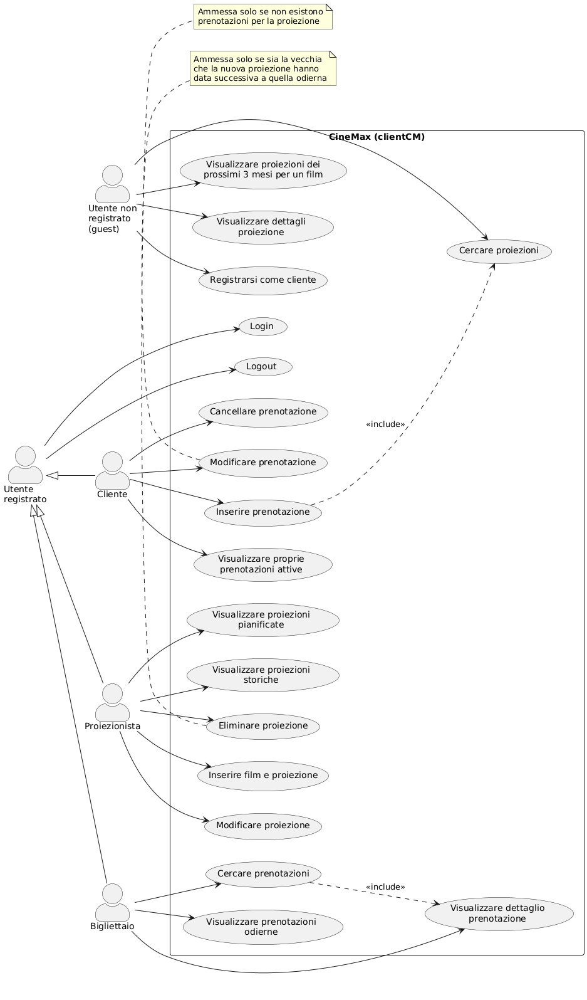
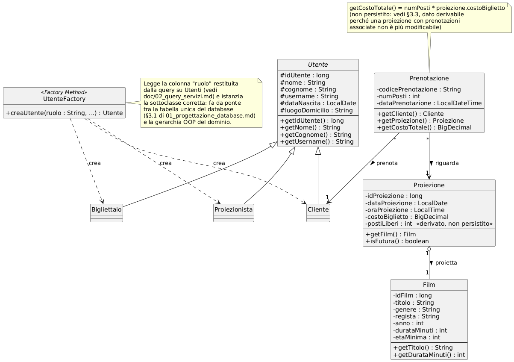
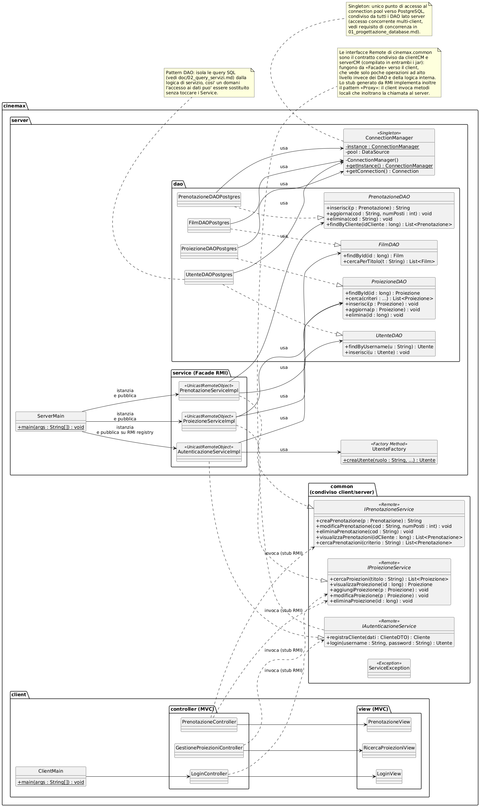
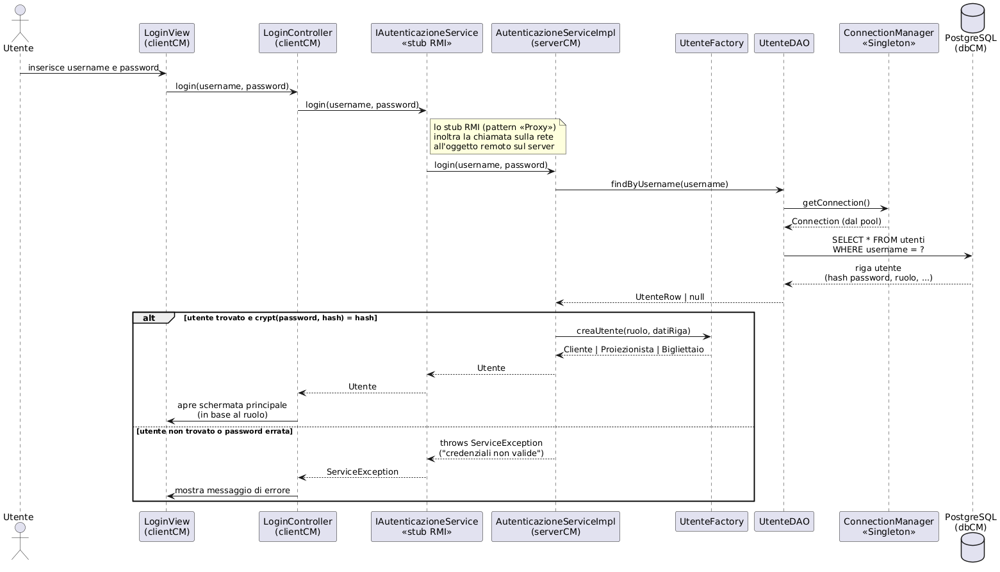
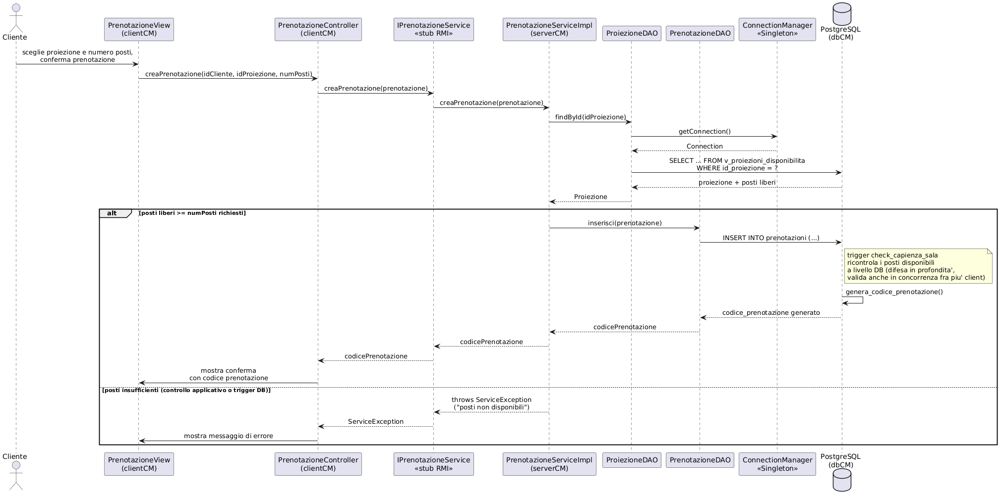
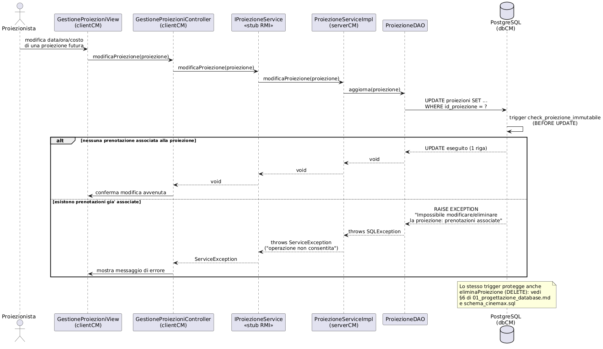

\newpage

# Introduzione

Questo documento è il **manuale tecnico** del progetto CineMax, realizzato per l'esame di Laboratorio Interdisciplinare B (a.a. 2025/2026). Descrive le scelte architetturali e algoritmiche adottate, le strutture dati utilizzate, la progettazione del software (con diagrammi UML) e la progettazione del database (con diagramma ER), come richiesto dalla specifica di progetto.

Il manuale è organizzato in quattro parti:

1. **Architettura e design pattern** — come sono strutturati e comunicano i moduli `serverCM` e `clientCM`, e quali design pattern sono stati adottati e perché.
2. **Progettazione del database** — analisi dei requisiti sui dati, schema E-R concettuale e ristrutturato, traduzione nello schema relazionale, realizzazione su PostgreSQL.
3. **Query SQL e servizi applicativi** — per ciascun servizio richiesto dalla specifica, la query (o le query) SQL che lo implementano lato server.
4. **Progettazione UML del software** — diagramma dei casi d'uso, diagramma delle classi (di dominio e architetturale), diagrammi di sequenza dei tre scenari più rappresentativi.

Per il manuale rivolto a chi utilizza l'applicazione (login, ricerca, prenotazione, gestione del palinsesto, ecc.) si veda il documento separato `manuale_utente_cinemax.pdf`.

\newpage

# Parte I — Architettura e Design Pattern

## 1. Architettura generale

La specifica richiede un'applicazione **client/server**, con due archivi jar
distinti (`serverCM` e `clientCM`) e "servizi erogati da interfacce di
programmazione", utilizzabile da più client contemporaneamente. Si è scelto di
realizzare la comunicazione client/server con **Java RMI (Remote Method
Invocation)**:

- il server pubblica un insieme di oggetti remoti (le "interfacce di
  programmazione" richieste dalla traccia) su un RMI registry;
- ogni client, dopo il lookup, ottiene uno **stub** locale che implementa la
  stessa interfaccia e inoltra le chiamate al server in modo trasparente;
- più client possono connettersi in concorrenza allo stesso server, che
  gestisce l'accesso condiviso al database (si veda il requisito di
  concorrenza discusso in `01_progettazione_database.md`).

Il codice condiviso fra client e server (le interfacce remote e le classi di
dominio serializzabili) è isolato in un package comune, compilato in entrambi
i jar.

```
cinemax
 ├── common      (interfacce Remote + classi di dominio, condiviso)
 ├── server      (implementazione dei servizi, DAO, accesso al DB, main server)
 └── client      (interfaccia utente, controller, main client)
```

Questa separazione rispecchia i due archivi richiesti dalla consegna:
`serverCM` include `cinemax.common` + `cinemax.server`; `clientCM` include
`cinemax.common` + `cinemax.client`.

## 2. Design pattern adottati

| Pattern | Dove | Motivazione |
|---|---|---|
| **DAO** (Data Access Object) | `cinemax.server.dao` (`FilmDAO`, `UtenteDAO`, `ProiezioneDAO`, `PrenotazioneDAO` + implementazioni `*Postgres`) | Isola le query SQL (già progettate in `02_query_servizi.md`) dalla logica di servizio: i `Service` non conoscono JDBC né SQL, e l'accesso ai dati potrebbe essere sostituito senza modificare la logica applicativa. |
| **Singleton** | `ConnectionManager` | Punto unico di accesso al pool di connessioni verso PostgreSQL lato server, condiviso da tutti i DAO: evita connessioni ridondanti e centralizza la gestione della concorrenza multi-client richiesta dalla traccia. |
| **Factory Method** | `UtenteFactory` | La tabella `utenti` è unica con colonna discriminante `ruolo` (scelta di ristrutturazione, §3.1 di `01_progettazione_database.md`); la factory legge il ruolo restituito dalla query e istanzia la sottoclasse Java corretta (`Cliente`, `Proiezionista`, `Bigliettaio`), facendo da ponte fra tabella unica e gerarchia OOP. |
| **Facade** | Le interfacce remote `IAutenticazioneService`, `IProiezioneService`, `IPrenotazioneService` | Espongono al client solo le operazioni ad alto livello richieste dai casi d'uso (login, ricerca proiezioni, prenotazione, ...), nascondendo DAO e logica interna del server dietro un'interfaccia semplice. |
| **Proxy** | Stub generato da Java RMI | Intrinseco al meccanismo RMI: il client invoca metodi su un oggetto locale (lo stub) che si comporta da proxy e inoltra la chiamata all'oggetto remoto reale sul server. |
| **MVC** | `cinemax.client.view` / `cinemax.client.controller` + classi di dominio come model | Separa l'interfaccia grafica (view) dalla logica di interazione (controller), che a sua volta invoca i servizi remoti; il model è costituito dalle classi di dominio condivise (`Film`, `Proiezione`, `Prenotazione`, ...). |


\newpage

# Parte II — Progettazione del Database


Laboratorio Interdisciplinare B — a.a. 2025/2026
Documento di progettazione concettuale e logica del database `dbCM`

---

## 1. Analisi dei requisiti (ristrutturata)

Dalle specifiche di progetto sono stati estratti e riorganizzati i seguenti requisiti relativi ai dati (si tralasciano, in questa fase, i requisiti puramente funzionali/applicativi già descritti nel documento di specifica).

### 1.1 Film

- Il sistema deve gestire un catalogo di **film**, ciascuno caratterizzato da: titolo, genere, regista, anno di uscita, durata, età minima consigliata per il pubblico.
- Un film può essere inserito dal proiezionista indipendentemente dalle proiezioni ad esso associate (un film può non avere ancora alcuna proiezione programmata).
- Un film può comparire in più proiezioni (in giorni/orari diversi).

### 1.2 Proiezioni (palinsesto)

- Ogni **proiezione** riguarda esattamente un film, in una data e un orario specifici, con un costo del biglietto associato.
- Il cinema è **monosala** con capienza fissa di **200 posti**: tale valore è un vincolo di dominio della sala, non richiede una entità dedicata (non esistono più sale).
- Due proiezioni non possono sovrapporsi nel tempo (stessa sala, stesso intervallo [inizio, inizio+durata) su date/orari in conflitto). *Vincolo inter-istanza, non esprimibile graficamente in ER: viene documentato in linguaggio naturale e implementato a livello di base di dati/applicazione.*
- Una proiezione può essere modificata (cambio data) o eliminata **solo se non esistono prenotazioni** ad essa associate.
- Il numero di posti liberi per una proiezione è un dato **derivato**: capienza sala (200) meno la somma dei posti prenotati per quella proiezione.

### 1.3 Utenti

- Il sistema distingue tre tipologie di utenti registrati, tutte modellate in un'unica tabella `Utenti` (vincolo esplicito di specifica): **clienti**, **proiezionisti**, **bigliettai**.
- Ogni utente ha: nome, cognome, username (univoco, usato per il login), password (memorizzata cifrata), data di nascita (facoltativa), luogo di domicilio, ruolo.
- La base dati deve contenere, già popolata, **2 proiezionisti** e **5 bigliettai**.
- Solo i **clienti** possono effettuare prenotazioni; proiezionisti e bigliettai non partecipano alla gestione delle prenotazioni proprie (i bigliettai le consultano, i proiezionisti gestiscono il palinsesto).
- Un utente non registrato (ospite) può cercare/visualizzare proiezioni e registrarsi come cliente, ma non può prenotare.

### 1.4 Prenotazioni

- Un **cliente registrato** può prenotare uno o più posti per una proiezione, a patto che il numero di posti richiesti sia **minore** del numero di posti disponibili in quel momento.
- Alla creazione di una prenotazione viene generato un **codice univoco** che la identifica (usato anche dai bigliettai per la ricerca).
- Una prenotazione può essere modificata (cambio data/proiezione) solo se sia la vecchia sia la nuova data di proiezione sono **successive alla data odierna**.
- Una prenotazione può essere cancellata dal cliente secondo la condizione descritta a specifica (proiezione con data **precedente** alla data odierna — *si segnala che tale condizione appare invertita rispetto alla logica applicativa attesa: normalmente si annulla una prenotazione futura, non una già trascorsa; il vincolo, essendo puramente temporale, non incide sullo schema del database ma solo sulla logica applicativa, e viene riportato qui letteralmente come da specifica, da verificare con il docente*).
- Il costo di una prenotazione è dato da: costo unitario del biglietto (quello della proiezione) × numero di posti prenotati. Non è necessario memorizzarlo come attributo ridondante: una proiezione con prenotazioni associate non può più essere modificata (vedi 1.2), quindi il costo unitario resta stabile e il totale è sempre calcolabile.
- Un bigliettaio può cercare prenotazioni per codice, per nome/cognome cliente, per titolo film (anche parziale), per intervallo di date.

### 1.5 Fonte dati iniziale

- Il docente fornisce un file `proiezioni.csv` con dati di partenza su film e proiezioni, da importare nel database (vedi §6, script di popolamento).

---

## 2. Schema concettuale Entità-Relazione (E-R)

Si adotta la notazione classica (Chen), con generalizzazione/specializzazione per modellare le tre tipologie di utente. Il diagramma è in `er_concettuale.png` (§5).

### 2.1 Entità e attributi

**FILM**
- `idFilm` (chiave primaria)
- titolo, genere, regista, anno, durata, etaMinima

**PROIEZIONE**
- `idProiezione` (chiave primaria)
- data, ora, costoBiglietto

**UTENTE** (entità padre della gerarchia)
- `idUtente` (chiave primaria)
- nome, cognome, `username` (chiave alternativa), password, dataNascita (opzionale), luogoDomicilio

Specializzazione **totale ed esclusiva** (ogni utente è di uno ed un solo tipo):
- **CLIENTE** — nessun attributo aggiuntivo
- **PROIEZIONISTA** — nessun attributo aggiuntivo
- **BIGLIETTAIO** — nessun attributo aggiuntivo

*(i tre ruoli non hanno attributi propri distinti nelle specifiche: la distinzione è puramente comportamentale/di permessi. La gerarchia viene comunque modellata concettualmente per chiarezza semantica, e sarà accorpata nella fase di ristrutturazione — vedi §3.)*

**PRENOTAZIONE**
- `codicePrenotazione` (chiave primaria, generato dal sistema)
- numPosti, dataPrenotazione (istante di creazione, per tracciabilità)

### 2.2 Relazioni e cardinalità

| Relazione | Entità coinvolte | Cardinalità | Significato |
|---|---|---|---|
| **Proietta** | FILM (0,N) — PROIEZIONE (1,1) | un film ha 0 o più proiezioni; ogni proiezione riguarda esattamente un film |
| **Prenota** | CLIENTE (0,N) — PRENOTAZIONE (1,1) | un cliente ha 0 o più prenotazioni; ogni prenotazione è fatta da esattamente un cliente |
| **Riguarda** | PROIEZIONE (0,N) — PRENOTAZIONE (1,1) | una proiezione ha 0 o più prenotazioni; ogni prenotazione riguarda esattamente una proiezione |

### 2.3 Vincoli di integrità aggiuntivi (linguaggio naturale)

Non esprimibili graficamente nel modello E-R:

1. **Unicità username**: `Utente.username` deve essere univoco nell'intera base di dati.
2. **Non sovrapposizione proiezioni**: per ogni coppia di proiezioni P1, P2 con P1 ≠ P2, gli intervalli [data+ora, data+ora+durata(film)) non devono intersecarsi (sala unica).
3. **Capienza sala**: per ogni proiezione, la somma di `numPosti` delle prenotazioni ad essa associate non può superare 200.
4. **Coerenza temporale prenotazioni**: la creazione/modifica di una prenotazione richiede che la/e proiezione/i coinvolta/e sia/siano relative a date successive alla data odierna (si veda l'osservazione al punto 1.4 sull'eliminazione).
5. **Immutabilità proiezione con prenotazioni**: una proiezione con almeno una prenotazione associata non può essere modificata né eliminata.

---

## 3. Ristrutturazione dello schema E-R

Prima della traduzione verso lo schema logico si applicano le seguenti trasformazioni, motivandole:

### 3.1 Accorpamento della gerarchia UTENTE nell'entità padre

Le specifiche richiedono esplicitamente **un'unica tabella `Utenti`** contenente un attributo `ruolo` con dominio {cliente, proiezionista, bigliettaio} (vedi specifica, slide 6). Inoltre le sottoentità CLIENTE, PROIEZIONISTA e BIGLIETTAIO non possiedono attributi propri: non c'è quindi perdita di espressività nell'accorpare l'intera gerarchia nel padre UTENTE, aggiungendo l'attributo discriminante `ruolo`.

Questa è la tecnica standard di ristrutturazione "accorpamento delle entità figlie nel padre": si elimina la gerarchia e si sposta l'informazione di tipo in un attributo. Di conseguenza:

- L'entità UTENTE assorbe CLIENTE, PROIEZIONISTA, BIGLIETTAIO e guadagna l'attributo `ruolo` (obbligatorio, dominio ristretto).
- La relazione **Prenota**, che nello schema concettuale coinvolgeva la sola sottoentità CLIENTE, viene ridefinita tra UTENTE e PRENOTAZIONE, accompagnata dal seguente **vincolo di integrità aggiuntivo** (non più esprimibile graficamente, da imporre con un CHECK/trigger a livello di base dati e comunque validato a livello applicativo):

  > *Un'istanza di UTENTE partecipa alla relazione Prenota solo se il valore del proprio attributo `ruolo` è `'cliente'`.*

### 3.2 Verifica delle forme normali

Tutti gli attributi individuati sono atomici (nessun attributo multivalore o composto), e ogni entità ha una chiave primaria mono-attributo (surrogata, `id*`) o comunque non decomponibile: non sussistono quindi dipendenze parziali né transitive rispetto alle chiavi. Lo schema risultante è già in **Terza Forma Normale (3NF)**; non sono state rilevate ridondanze da eliminare (si veda anche la scelta di non memorizzare il costo totale della prenotazione come attributo derivato, §1.4).

### 3.3 Analisi delle ridondanze e dei dati derivati

- Il **numero di posti liberi** di una proiezione è un dato derivabile (200 − Σ posti prenotati) e non viene quindi materializzato come attributo, per evitare anomalie di aggiornamento.
- Il **costo totale** di una prenotazione è anch'esso derivabile (costoBiglietto × numPosti) e non viene materializzato, per lo stesso motivo (si ricorda che una proiezione con prenotazioni non è più modificabile, quindi il calcolo resta sempre corretto e stabile nel tempo).

### 3.4 Schema E-R ristrutturato (riepilogo)

Al termine della ristrutturazione lo schema è composto da 4 entità (FILM, PROIEZIONE, UTENTE, PRENOTAZIONE) e 3 relazioni binarie, tutte con cardinalità massima (1,1) da un lato — situazione ottimale per la traduzione verso lo schema relazionale (vedi §4). Il diagramma ristrutturato è in `er_ristrutturato.png` (§5).

---

## 4. Traduzione nello schema logico relazionale

Regola applicata: ogni relazione binaria in cui una delle due entità partecipa con cardinalità massima 1 (qui: sempre il lato "molti" verso "uno") viene tradotta **senza tabella separata**, aggiungendo una chiave esterna nella tabella corrispondente all'entità con cardinalità (1,1). Questo evita join aggiuntivi e tabelle ponte non necessarie, dato che nessuna delle tre relazioni ha cardinalità massima N su entrambi i lati.

### 4.1 Schema relazionale risultante

```
film(id_film, titolo, genere, regista, anno, durata_minuti, eta_minima)

proiezioni(id_proiezione, id_film → film, data_proiezione, ora_proiezione, costo_biglietto)

utenti(id_utente, nome, cognome, username, password_hash, data_nascita, luogo_domicilio, ruolo)

prenotazioni(codice_prenotazione, id_utente → utenti, id_proiezione → proiezioni,
             num_posti, data_prenotazione)
```

Legenda: sottolineate (qui in **grassetto concettuale**) le chiavi primarie `id_film`, `id_proiezione`, `id_utente`, `codice_prenotazione`; `→` indica chiave esterna (foreign key).

### 4.2 Motivazione delle scelte di traduzione

- **Proietta** (FILM 0,N — PROIEZIONE 1,1): la FK `id_film` va nella tabella `proiezioni` (lato con cardinalità massima 1), NOT NULL perché la partecipazione di PROIEZIONE è totale (1,1).
- **Prenota** (UTENTE 0,N — PRENOTAZIONE 1,1): la FK `id_utente` va nella tabella `prenotazioni`, NOT NULL. Il vincolo "solo utenti con ruolo = cliente" (§3.1) viene implementato con un **trigger** (non esprimibile con un semplice CHECK, perché richiede di leggere un'altra tabella) — vedi script SQL, §6.
- **Riguarda** (PROIEZIONE 0,N — PRENOTAZIONE 1,1): la FK `id_proiezione` va nella tabella `prenotazioni`, NOT NULL.
- Nessuna delle 4 entità richiede accorpamento reciproco (non ci sono relazioni 1:1 tra le entità stesse): lo schema resta con 4 tabelle distinte, tutte in 3NF, come previsto dalla traccia.
- `username` viene dichiarato `UNIQUE` (chiave alternativa individuata in fase concettuale).
- `codice_prenotazione` è generato automaticamente dal DB al momento dell'inserimento, tramite la funzione `genera_codice_prenotazione()` (codice alfanumerico leggibile di 8 caratteri, usato come default della colonna — vedi §6).

---

## 5. Diagrammi


Schema E-R concettuale, con gerarchia di generalizzazione UTENTE → {CLIENTE, PROIEZIONISTA, BIGLIETTAIO} (totale ed esclusiva, notazione "t, e").


Schema E-R dopo la ristrutturazione (gerarchia accorpata in UTENTE + attributo `ruolo`, con annotazione del vincolo di integrità risultante).

I diagrammi sono stati generati con Graphviz in notazione Chen (entità = rettangolo, relazione = rombo, attributo = ellisse, chiave = testo sottolineato, attributo opzionale = ellisse tratteggiata).

---

## 6. Realizzazione su PostgreSQL

Lo schema è stato implementato ed eseguito con successo su PostgreSQL 16 (script `db/schema_cinemax.sql`), verificando che tutti i vincoli procedurali si attivino correttamente:

| File | Contenuto |
|---|---|
| `db/schema_cinemax.sql` | tabelle, chiavi, vincoli `CHECK`/`UNIQUE`/`FK`, funzioni e trigger per i vincoli non esprimibili in DDL dichiarativo (§2.3), vista `v_proiezioni_disponibilita`, seed obbligatorio (2 proiezionisti + 5 bigliettai) |
| `db/dati_esempio.sql` | dati facoltativi (film, proiezioni, un cliente e una prenotazione) usati **solo** per verificare lo schema — da sostituire con l'import di `proiezioni.csv` |

### 6.1 Test eseguiti (in questa sessione, su istanza PostgreSQL locale)

Lo script è stato eseguito end-to-end e sono stati verificati con esito positivo i seguenti casi:

1. creazione di tutte le tabelle, indici, funzioni, trigger, vista e seed senza errori;
2. rifiuto di una prenotazione da parte di un utente con ruolo diverso da `cliente`;
3. rifiuto di una prenotazione che supererebbe la capienza della sala (200 posti);
4. rifiuto dell'inserimento di una proiezione sovrapposta a una esistente;
5. rifiuto della cancellazione di una proiezione con prenotazioni associate;
6. rifiuto di un `username` duplicato (vincolo `UNIQUE`).

### 6.2 Note per i prossimi passi

- **`proiezioni.csv`**: il file draft del docente non è ancora stato caricato in questa sessione. Quando disponibile, va scritto uno script di import (SQL `COPY`/`\copy` oppure utility Java/JDBC) coerente con le colonne effettive del file: caricalo pure per generarlo.
- **Vincolo sull'eliminazione delle prenotazioni** (§1.4): la condizione "data di proiezione precedente la data odierna" riportata nella specifica per `eliminaPrenotazione()` sembra invertita rispetto alla logica applicativa attesa — verificare col docente prima di implementare la funzionalità lato applicazione (non impatta lo schema del database).
- **Password**: nel seed sono usate password dimostrative cifrate con `pgcrypto` (`crypt()`/`gen_salt('bf')`); l'applicazione Java potrà verificarle con la stessa funzione (`SELECT ... WHERE crypt(input, password_hash) = password_hash`) oppure sostituire l'approccio con hashing lato applicativo (es. jBCrypt), aggiornando di conseguenza gli INSERT di seed.
- Questa è la fase di **progettazione del database**; il prossimo passo naturale è la progettazione UML dell'applicazione (casi d'uso, diagramma delle classi, design pattern) e poi lo sviluppo di `serverCM`/`clientCM`.

\newpage

# Parte III — Query SQL e Servizi Applicativi


Laboratorio Interdisciplinare B — a.a. 2025/2026

Questo documento raccoglie, per ciascuna funzionalità richiesta dalle specifiche di progetto, la query SQL (PostgreSQL) che la implementa. È il completamento richiesto esplicitamente a specifica: *"Documentare [...] le query SQL a supporto dei servizi erogati da Interfacce di Programmazione"*.

Convenzioni:
- I placeholder `?` indicano i parametri che verranno passati come `PreparedStatement` da JDBC (nell'ordine in cui compaiono).
- Le query di ricerca con criteri opzionali usano il pattern `(? IS NULL OR condizione)`: se il parametro è `NULL` la condizione è ignorata. Con JDBC, il parametro va passato **due volte** (una per il test `IS NULL`, una per il confronto) — alternativa più pulita: costruire la query dinamicamente lato Java concatenando solo le condizioni per i criteri effettivamente impostati (scelta implementativa da fissare in fase di sviluppo).
- Tutte le query sono state validate eseguendole su un'istanza PostgreSQL 16 con lo schema di `schema_cinemax.sql` e i dati di `dati_esempio.sql` (vedi in fondo al documento).

---

## Consultazione proiezioni (login non necessario)

### `cercaProiezione(titolo, genere, dataDa, dataA, costoMin, costoMax)`

Ricerca combinabile per titolo (parziale), genere, intervallo di date, intervallo di costo.

```sql
SELECT id_proiezione, id_film, titolo, genere, regista, anno, durata_minuti,
       eta_minima, data_proiezione, ora_proiezione, costo_biglietto, posti_liberi
FROM v_proiezioni_disponibilita
WHERE (?::text  IS NULL OR titolo ILIKE '%' || ?::text  || '%')
  AND (?::text  IS NULL OR genere = ?::text)
  AND (?::date  IS NULL OR data_proiezione >= ?::date)
  AND (?::date  IS NULL OR data_proiezione <= ?::date)
  AND (?::numeric IS NULL OR costo_biglietto >= ?::numeric)
  AND (?::numeric IS NULL OR costo_biglietto <= ?::numeric)
ORDER BY data_proiezione, ora_proiezione;
```

### `visualizzaProiezione(idProiezione)`

Dettagli di una proiezione selezionata dopo la ricerca: caratteristiche del film, data/ora, costo, posti liberi (dato derivato — vedi `doc/01_progettazione_database.md`, §3.3).

```sql
SELECT id_proiezione, id_film, titolo, genere, regista, anno, durata_minuti,
       eta_minima, data_proiezione, ora_proiezione, costo_biglietto, posti_liberi
FROM v_proiezioni_disponibilita
WHERE id_proiezione = ?;
```

### Schermata iniziale per l'utente `guest`

Proiezioni nei tre mesi successivi alla data odierna per un film indicato (anche parzialmente).

```sql
SELECT id_proiezione, id_film, titolo, genere, regista, anno, durata_minuti,
       eta_minima, data_proiezione, ora_proiezione, costo_biglietto, posti_liberi
FROM v_proiezioni_disponibilita
WHERE titolo ILIKE '%' || ? || '%'
  AND data_proiezione BETWEEN CURRENT_DATE AND (CURRENT_DATE + INTERVAL '3 months')
ORDER BY data_proiezione, ora_proiezione;
```

---

## Registrazione (login non necessario)

### `registraCliente(nome, cognome, username, password, dataNascita, luogoDomicilio)`

Verifica preliminare di disponibilità dello `username` (in alternativa: tentare direttamente l'`INSERT` e intercettare la violazione del vincolo `UNIQUE`):

```sql
SELECT 1 FROM utenti WHERE username = ?;
```

Inserimento (password cifrata con `pgcrypto`; `dataNascita` è facoltativa, può essere passata come `NULL`):

```sql
INSERT INTO utenti (nome, cognome, username, password_hash, data_nascita, luogo_domicilio, ruolo)
VALUES (?, ?, ?, crypt(?, gen_salt('bf')), ?, ?, 'cliente')
RETURNING id_utente;
```

---

## Autenticazione (comune a cliente, proiezionista, bigliettaio)

```sql
SELECT id_utente, nome, cognome, ruolo
FROM utenti
WHERE username = ?
  AND password_hash = crypt(?, password_hash);
```

Nessuna riga restituita ⇒ credenziali errate. Il `ruolo` letto determina il menù da presentare all'utente.

---

## Interazione dei clienti (login necessario)

### `visualizzaPrenotazione(idUtente)` — prenotazioni attive del cliente

"Attive" = relative a una proiezione successiva alla data odierna (vedi specifica, slide 15).

```sql
SELECT pr.codice_prenotazione, pr.num_posti, pr.data_prenotazione,
       f.titolo, p.data_proiezione, p.ora_proiezione, p.costo_biglietto,
       (pr.num_posti * p.costo_biglietto) AS costo_totale
FROM prenotazioni pr
JOIN proiezioni p ON p.id_proiezione = pr.id_proiezione
JOIN film f       ON f.id_film = p.id_film
WHERE pr.id_utente = ?
  AND p.data_proiezione > CURRENT_DATE
ORDER BY p.data_proiezione, p.ora_proiezione;
```

### `creaPrenotazione(idUtente, idProiezione, numPosti)`

La verifica "posti richiesti < posti disponibili" può essere anticipata lato applicativo con una query di controllo, ma è comunque garantita a livello di database dal trigger `trg_capienza_sala` (che impedisce il superamento dei 200 posti) e da `trg_ruolo_cliente` (solo utenti con ruolo `cliente` possono prenotare) — vedi `schema_cinemax.sql`.

```sql
-- (opzionale) controllo preliminare posti disponibili
SELECT posti_liberi FROM v_proiezioni_disponibilita WHERE id_proiezione = ?;

-- inserimento; il codice prenotazione è generato automaticamente dal DB
INSERT INTO prenotazioni (id_utente, id_proiezione, num_posti)
VALUES (?, ?, ?)
RETURNING codice_prenotazione;
```

### `modificaPrenotazione(codicePrenotazione, nuovaIdProiezione)` — cambio proiezione/data

Precondizione di specifica: sia la vecchia sia la nuova data di proiezione devono essere successive alla data odierna. Questo è un vincolo **temporale**, verificato lato applicativo (non è esprimibile con un trigger sullo stato del database in modo pulito, perché dipende dalla proiezione scelta *prima* dell'update):

```sql
-- 1) recupero la data della proiezione attualmente associata alla prenotazione
SELECT p.data_proiezione
FROM prenotazioni pr JOIN proiezioni p ON p.id_proiezione = pr.id_proiezione
WHERE pr.codice_prenotazione = ?;

-- 2) recupero la data della nuova proiezione scelta
SELECT data_proiezione FROM proiezioni WHERE id_proiezione = ?;

-- 3) se entrambe le date sono > CURRENT_DATE (verificato in Java), si applica l'update
--    (il trigger di capienza sala si riattiva automaticamente anche in UPDATE)
UPDATE prenotazioni
SET id_proiezione = ?
WHERE codice_prenotazione = ?;
```

### `eliminaPrenotazione(codicePrenotazione)`

**Nota**: la specifica condiziona l'eliminazione a "data di proiezione precedente alla data odierna" (slide 12), condizione che appare invertita rispetto alla logica applicativa attesa (si veda `doc/01_progettazione_database.md`, §1.4) — da verificare col docente. La query di cancellazione non cambia in base a quale sia l'interpretazione corretta; cambia solo il controllo (in Java) sulla data prima di eseguirla:

```sql
-- controllo preliminare (verificare in Java la condizione sulla data secondo l'interpretazione confermata)
SELECT p.data_proiezione
FROM prenotazioni pr JOIN proiezioni p ON p.id_proiezione = pr.id_proiezione
WHERE pr.codice_prenotazione = ?;

DELETE FROM prenotazioni WHERE codice_prenotazione = ?;
```

---

## Interazione dei bigliettai (login necessario)

### Prenotazioni nella data odierna

```sql
SELECT pr.codice_prenotazione, u.nome, u.cognome, f.titolo,
       p.data_proiezione, p.ora_proiezione, pr.num_posti, p.costo_biglietto,
       (pr.num_posti * p.costo_biglietto) AS costo_totale
FROM prenotazioni pr
JOIN utenti u     ON u.id_utente = pr.id_utente
JOIN proiezioni p ON p.id_proiezione = pr.id_proiezione
JOIN film f       ON f.id_film = p.id_film
WHERE p.data_proiezione = CURRENT_DATE
ORDER BY p.ora_proiezione;
```

### `cercaPrenotazione(codice, nomeCognome, titoloFilm, dataDa, dataA)`

```sql
SELECT pr.codice_prenotazione, u.nome, u.cognome, f.titolo,
       p.data_proiezione, p.ora_proiezione, pr.num_posti, p.costo_biglietto,
       (pr.num_posti * p.costo_biglietto) AS costo_totale
FROM prenotazioni pr
JOIN utenti u     ON u.id_utente = pr.id_utente
JOIN proiezioni p ON p.id_proiezione = pr.id_proiezione
JOIN film f       ON f.id_film = p.id_film
WHERE (?::text IS NULL OR pr.codice_prenotazione = ?::text)
  AND (?::text IS NULL OR u.nome ILIKE '%' || ?::text || '%' OR u.cognome ILIKE '%' || ?::text || '%')
  AND (?::text IS NULL OR f.titolo ILIKE '%' || ?::text || '%')
  AND (?::date IS NULL OR p.data_proiezione >= ?::date)
  AND (?::date IS NULL OR p.data_proiezione <= ?::date)
ORDER BY p.data_proiezione, p.ora_proiezione;
```

### `visualizzaPrenotazione(codicePrenotazione)` — dettaglio (bigliettaio)

```sql
SELECT pr.codice_prenotazione, u.nome, u.cognome, f.titolo,
       p.data_proiezione, p.ora_proiezione, pr.num_posti, p.costo_biglietto,
       (pr.num_posti * p.costo_biglietto) AS costo_totale
FROM prenotazioni pr
JOIN utenti u     ON u.id_utente = pr.id_utente
JOIN proiezioni p ON p.id_proiezione = pr.id_proiezione
JOIN film f       ON f.id_film = p.id_film
WHERE pr.codice_prenotazione = ?;
```

---

## Interazione dei proiezionisti (login necessario)

### `aggiungiProiezione(...)` — nuovo film + proiezione

Per specifica, il proiezionista prima inserisce un film e poi, per quel film, data e costo di ogni proiezione. Se il film esiste già a catalogo si esegue solo il secondo passo.

```sql
-- 1) nuovo film (solo se non già presente a catalogo)
INSERT INTO film (titolo, genere, regista, anno, durata_minuti, eta_minima)
VALUES (?, ?, ?, ?, ?, ?)
RETURNING id_film;

-- 2) nuova proiezione per il film (id_film noto dal passo precedente o da catalogo esistente)
-- il trigger trg_sovrapposizione_proiezione impedisce automaticamente le sovrapposizioni
INSERT INTO proiezioni (id_film, data_proiezione, ora_proiezione, costo_biglietto)
VALUES (?, ?, ?, ?)
RETURNING id_proiezione;
```

### Proiezioni pianificate (successive alla data odierna)

```sql
SELECT id_proiezione, id_film, titolo, data_proiezione, ora_proiezione,
       costo_biglietto, posti_liberi
FROM v_proiezioni_disponibilita
WHERE data_proiezione > CURRENT_DATE
ORDER BY data_proiezione, ora_proiezione;
```

### Proiezioni storiche (precedenti alla data odierna)

```sql
SELECT id_proiezione, id_film, titolo, data_proiezione, ora_proiezione,
       costo_biglietto, posti_liberi
FROM v_proiezioni_disponibilita
WHERE data_proiezione < CURRENT_DATE
ORDER BY data_proiezione DESC, ora_proiezione DESC;
```

### `modificaProiezione(idProiezione, nuovaData, nuovaOra, nuovoCosto)`

Ammessa solo se non esistono prenotazioni per la proiezione: vincolo garantito dal trigger `trg_proiezione_immutabile_update` (fallisce con eccezione se ci sono prenotazioni). Il trigger di sovrapposizione (`trg_sovrapposizione_proiezione`) si riattiva automaticamente anche in `UPDATE`.

```sql
UPDATE proiezioni
SET data_proiezione = ?, ora_proiezione = ?, costo_biglietto = ?
WHERE id_proiezione = ?;
```

### `eliminaProiezione(idProiezione)`

Ammessa solo se non esistono prenotazioni: vincolo garantito dal trigger `trg_proiezione_immutabile_delete`.

```sql
DELETE FROM proiezioni WHERE id_proiezione = ?;
```

---

## Verifica

Tutte le query sopra sono state eseguite (con valori di prova) su un'istanza PostgreSQL 16 con lo schema definito in `src/main/resources/db/schema_cinemax.sql`, popolato con i dati di `src/main/resources/db/dati_esempio.sql`: hanno prodotto risultati corretti e i trigger di vincolo si sono attivati correttamente nei casi limite (posti insufficienti, ruolo non cliente, sovrapposizione proiezioni, proiezione con prenotazioni).

\newpage

# Parte IV — Progettazione UML del Software

## 3. Diagramma dei casi d'uso



Gli attori sono derivati dai ruoli previsti dalla traccia: un utente non
registrato (guest) può cercare/visualizzare proiezioni e registrarsi; un
utente registrato si specializza in **Cliente** (prenotazioni), **Proiezionista**
(gestione proiezioni) e **Bigliettaio** (consultazione/ricerca prenotazioni in
biglietteria). I vincoli applicativi non esprimibili graficamente (es. una
proiezione modificabile solo se non ha prenotazioni associate) sono annotati
come note sui singoli casi d'uso, e corrispondono ai trigger già implementati
lato database (`check_proiezione_immutabile` in `schema_cinemax.sql`).

## 4. Diagramma delle classi di dominio



Rappresenta il modello concettuale delle entità applicative (`Utente` e le sue
specializzazioni, `Film`, `Proiezione`, `Prenotazione`) così come viste dal
client, indipendentemente dai dettagli di persistenza. Corrisponde alle
entità/attributi dello schema ER ristrutturato (§3 di
`01_progettazione_database.md`); in particolare `Prenotazione.getCostoTotale()`
è un dato derivato non persistito (§3.3) e la gerarchia `Utente` rispecchia la
scelta di accorpamento ISA con attributo `ruolo` (§3.1).

## 5. Diagramma delle classi architetturale



Mostra come i pattern del §2 si traducono in classi concrete: le interfacce
remote in `cinemax.common`, le loro implementazioni server-side (`*ServiceImpl`,
facciate RMI), i DAO e il `ConnectionManager`, fino ai controller/view lato
client che invocano gli stub RMI.

## 6. Diagrammi di sequenza

Tre scenari rappresentativi, scelti per mostrare il percorso completo
client → stub RMI → service (server) → DAO → database, comprese le
interazioni con i vincoli implementati a livello di database (§6 di
`01_progettazione_database.md`).

### 6.1 Login



Il client invoca `login` sullo stub RMI di `IAutenticazioneService`; il
server recupera l'utente tramite `UtenteDAO` e verifica la password con
`crypt()` (pgcrypto, vedi `schema_cinemax.sql`). In caso di successo,
`UtenteFactory` istanzia la sottoclasse corretta in base al `ruolo`
(pattern Factory Method, §2); in caso di credenziali non valide viene
propagata una `ServiceException` che il client mostra come errore.

### 6.2 Creazione di una prenotazione



Il servizio verifica la disponibilità di posti leggendo
`v_proiezioni_disponibilita`, poi inserisce la prenotazione. Il controllo
di capienza è applicato **due volte**: a livello applicativo (prima
dell'INSERT) e a livello database dal trigger `check_capienza_sala`
(difesa in profondità, indispensabile in presenza di più client
concorrenti che potrebbero prenotare sulla stessa proiezione nello stesso
istante). Il codice prenotazione è generato lato database da
`genera_codice_prenotazione()`.

### 6.3 Modifica di una proiezione con prenotazioni associate



Mostra il caso in cui l'operazione viene rifiutata: il trigger
`check_proiezione_immutabile` (BEFORE UPDATE/DELETE) impedisce la
modifica o l'eliminazione di una proiezione che ha già prenotazioni
associate, sollevando un'eccezione che risale fino al client come
`ServiceException`. Questo trigger è lo stesso corretto durante la
progettazione del database (bug del `RETURN OLD` in caso di UPDATE, vedi
`schema_cinemax.sql`), qui verificato anche dal punto di vista del
flusso applicativo end-to-end.
