\newpage

# Introduzione

Questo documento spiega come si usa **CineMax**, l'applicazione per la gestione di un cinema monosala da 200 posti, sviluppata per l'esame di Laboratorio Interdisciplinare B. Ogni funzionalità è descritta insieme a uno screenshot reale dell'interfaccia grafica, presa dall'applicazione effettivamente funzionante (client `clientCM` collegato al server `serverCM`).

L'applicazione distingue quattro tipi di utilizzatori:

- **Ospite (guest)** — chi apre l'applicazione senza aver effettuato il login: può solo cercare/visualizzare le proiezioni e registrarsi.
- **Cliente** — utente registrato che può prenotare posti per le proiezioni.
- **Proiezionista** — utente registrato che gestisce il palinsesto (film e proiezioni).
- **Bigliettaio** — utente registrato che consulta e cerca le prenotazioni in biglietteria.

Per i dettagli tecnici (architettura, database, design pattern) si veda il documento separato `manuale_tecnico_cinemax.pdf`.

\newpage

# 1. Avvio dell'applicazione

Prima di usare il client bisogna avviare il server (`serverCM`), che chiede da tastiera l'host e le credenziali del database, e poi resta in ascolto. Fatto questo, si può avviare una o più copie del client (`clientCM`): ognuna chiede l'indirizzo del server a cui collegarsi tramite una finestra di dialogo, e poi apre la finestra principale dell'applicazione, mostrando il menu iniziale.

# 2. Funzionalità disponibili senza login (ospite)

## 2.1 Menu iniziale

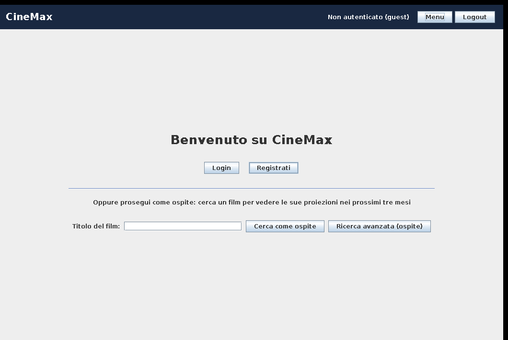

È la prima schermata che si vede all'avvio. Da qui un utente non ancora autenticato ("guest", come indicato in alto a destra) può: fare login, registrarsi come nuovo cliente, oppure proseguire subito come ospite scrivendo il titolo (anche parziale) di un film e premendo **"Cerca come ospite"**. In questo caso vengono mostrate le proiezioni di quel film nei tre mesi successivi alla data odierna, come richiesto dalla specifica di progetto. Il pulsante **"Ricerca avanzata (ospite)"** porta invece alla schermata di ricerca completa (§2.2).

## 2.2 Ricerca proiezioni

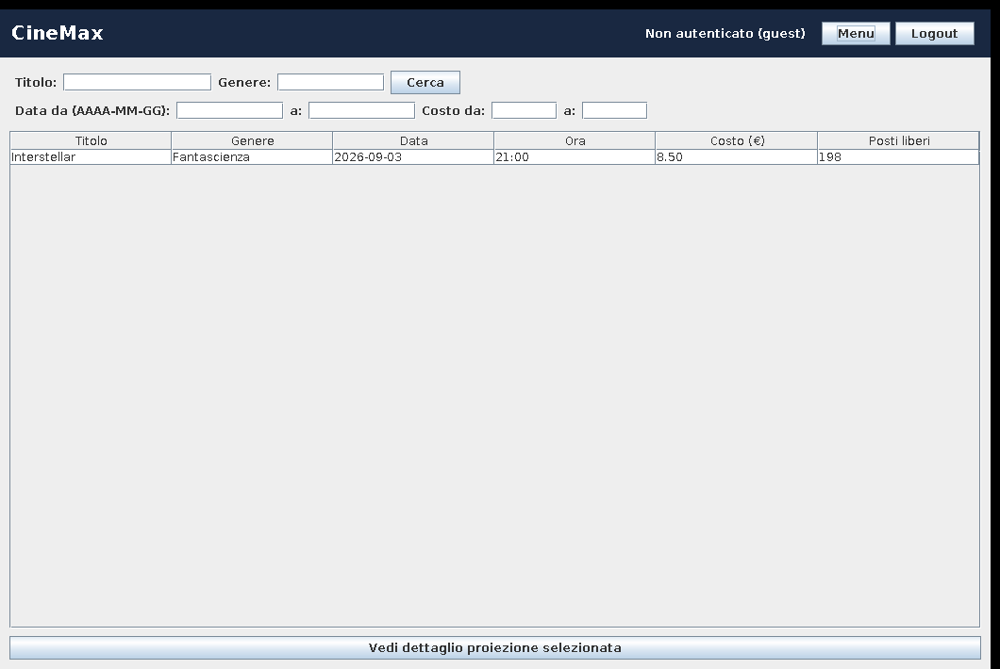

Questa schermata permette di cercare le proiezioni disponibili combinando più criteri insieme: titolo del film (anche parziale), genere, intervallo di date e intervallo di costo del biglietto. Tutti i campi sono opzionali: se lasciati vuoti non vengono applicati. I risultati compaiono nella tabella, con titolo, genere, data, ora, costo e numero di posti ancora liberi. Selezionando una riga e premendo **"Vedi dettaglio proiezione selezionata"** si passa alla schermata di dettaglio (§2.3).

## 2.3 Dettaglio di una proiezione

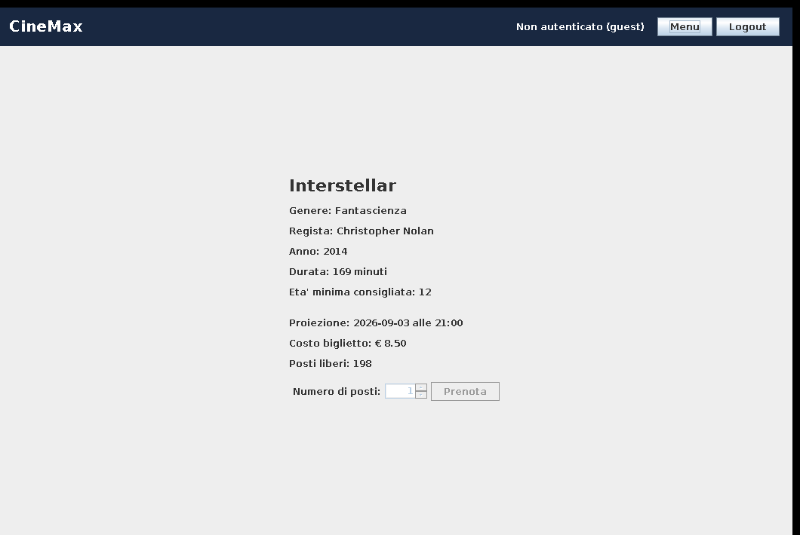

Mostra tutte le informazioni sul film scelto (genere, regista, anno, durata, età minima consigliata) e sulla proiezione (data, ora, costo del biglietto, posti liberi). Se non si è autenticati come cliente, come in questo caso, il campo "Numero di posti" e il pulsante **"Prenota"** sono disattivati: per prenotare bisogna prima registrarsi o accedere.

## 2.4 Registrazione di un nuovo cliente

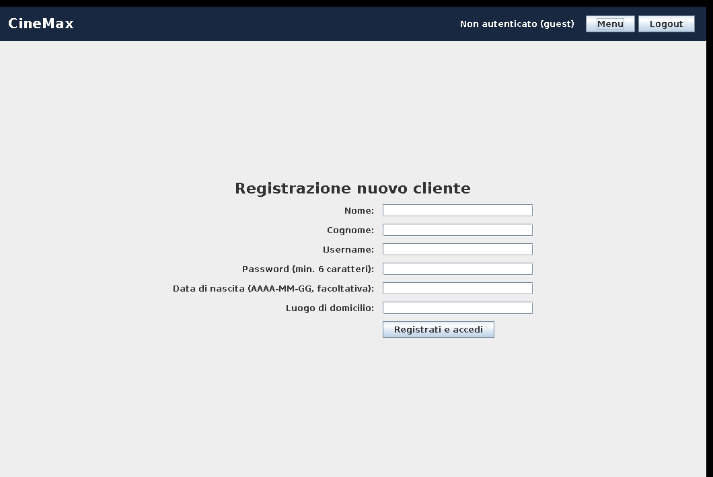

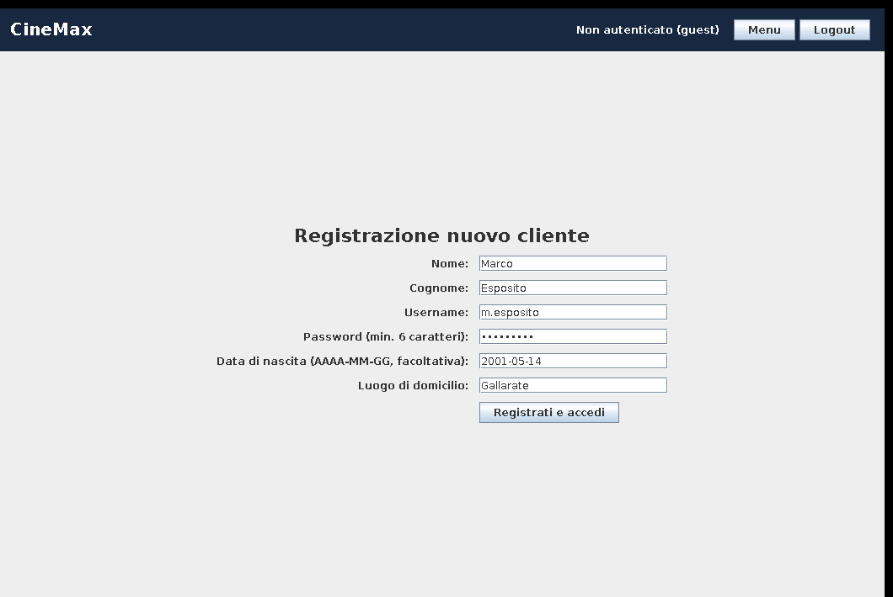

Dal menu iniziale, il pulsante **"Registrati"** apre questo modulo, dove un nuovo utente inserisce nome, cognome, username (deve essere univoco), password (minimo 6 caratteri, viene salvata cifrata nel database), data di nascita (facoltativa) e luogo di domicilio. Il nuovo account viene sempre creato con ruolo "cliente": proiezionisti e bigliettai sono account già presenti nel sistema, creati in fase di installazione del database.

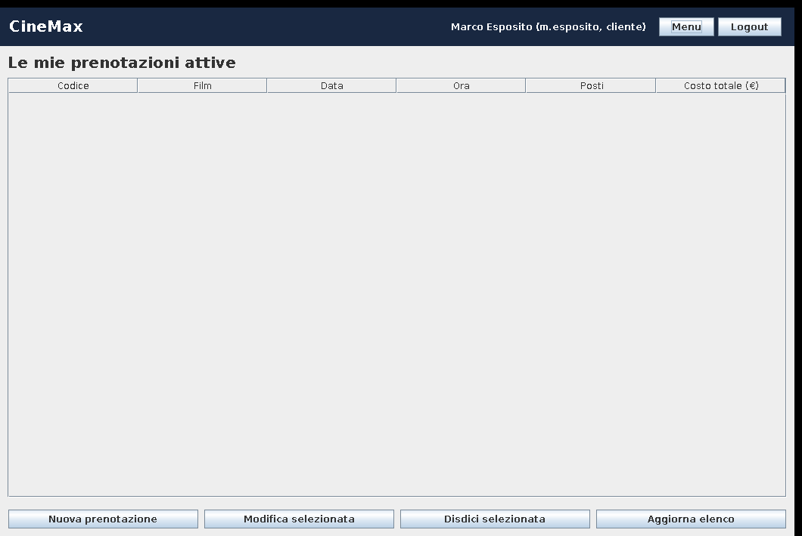

Dopo aver premuto **"Registrati e accedi"**, se i dati sono validi l'applicazione effettua subito il login con il nuovo account e porta l'utente alla propria area cliente (§3), come si vede dall'intestazione in alto a destra che ora mostra nome, cognome e ruolo.

## 2.5 Login

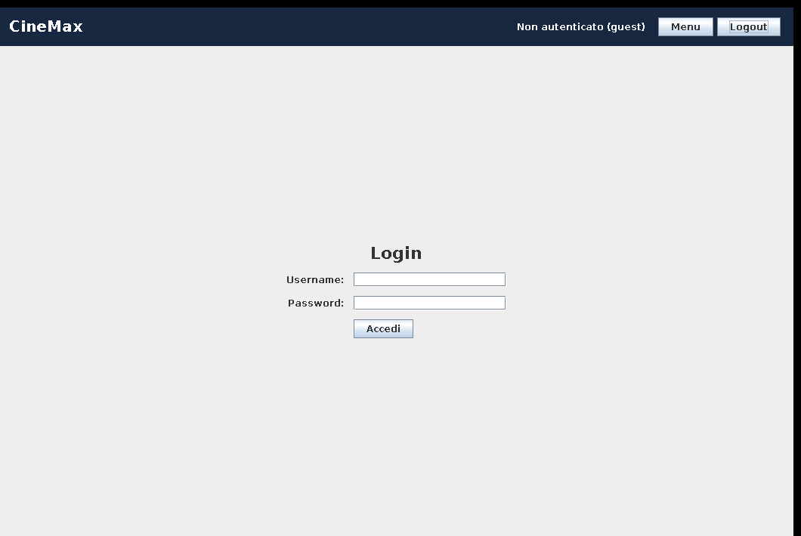

Chi ha già un account può accedere da qui inserendo username e password. In caso di credenziali sbagliate viene mostrato un messaggio di errore e si resta sulla schermata di login.

\newpage

# 3. Funzionalità del cliente (login necessario)

## 3.1 Nuova prenotazione

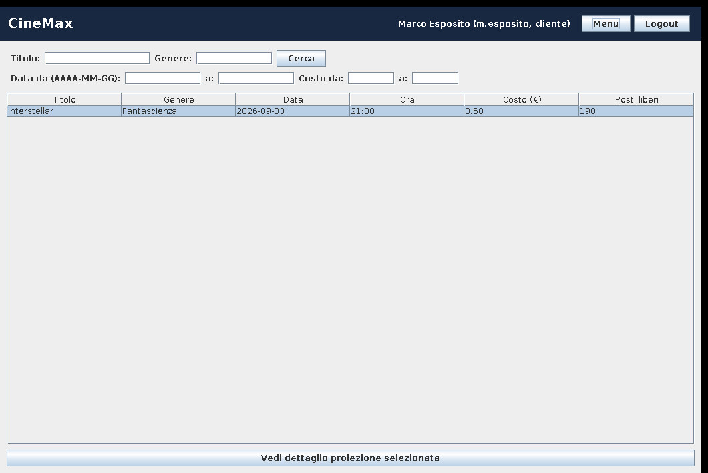

Dalla propria area, un cliente registrato può premere **"Nuova prenotazione"**: si apre la stessa schermata di ricerca vista al §2.2, questa volta usata per scegliere la proiezione da prenotare.

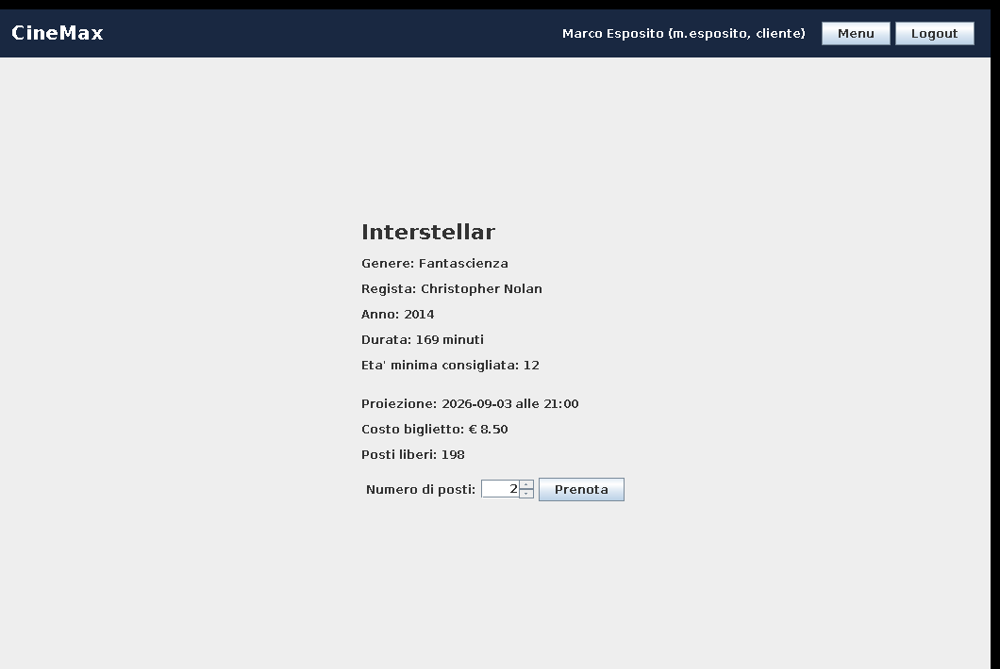

Selezionata una proiezione, nella schermata di dettaglio il campo "Numero di posti" e il pulsante "Prenota" sono ora attivi (a differenza della vista come ospite, §2.3). Si sceglie quanti posti prenotare — l'applicazione verifica che siano disponibili — e si conferma.

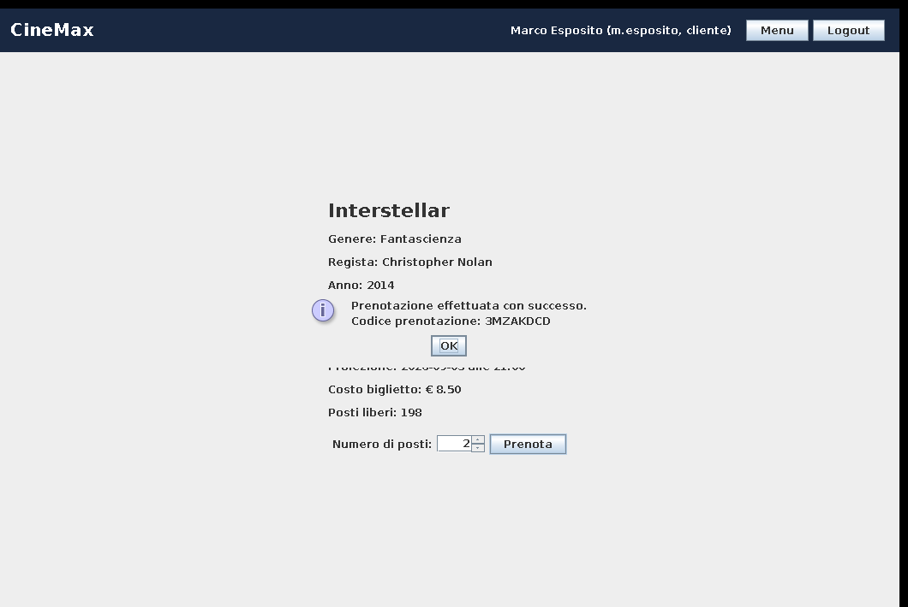

Se la prenotazione va a buon fine, l'applicazione mostra il **codice univoco** generato automaticamente dal sistema (da conservare: serve, ad esempio, ai bigliettai per ritrovare la prenotazione, §5.2).

## 3.2 Le mie prenotazioni attive

È la schermata principale dell'area cliente: elenca le prenotazioni ancora attive (relative a proiezioni con data successiva a quella odierna), con codice, film, data, ora, numero di posti e costo totale (calcolato come costo unitario del biglietto per numero di posti). Da qui si può creare una nuova prenotazione, modificarne una esistente (cambiare la proiezione a cui si riferisce) oppure disdirla, selezionando prima la riga corrispondente. Il pulsante "Aggiorna elenco" ricarica i dati più recenti dal server.

## 3.3 Disdire una prenotazione

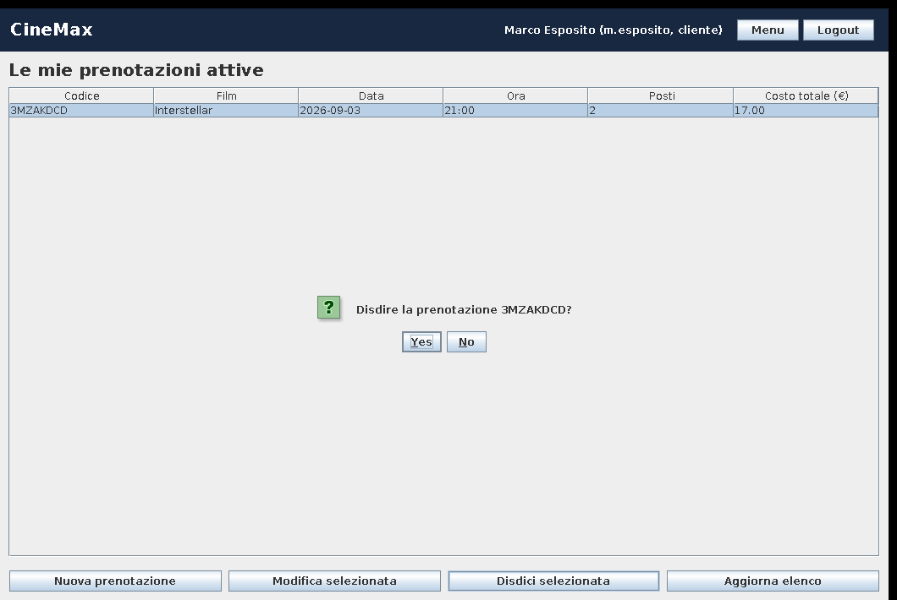

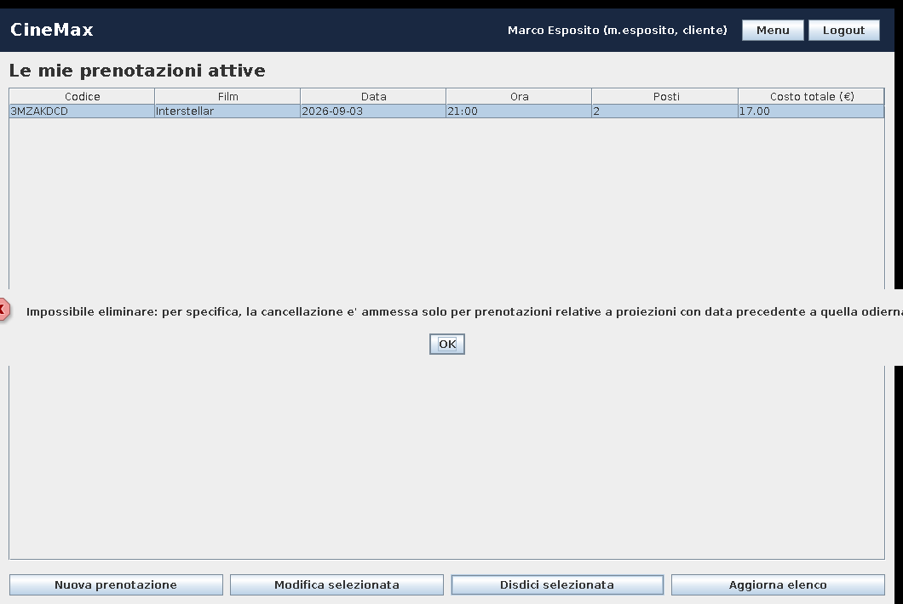

Selezionando una prenotazione e premendo **"Disdici selezionata"** viene chiesta una conferma. **Attenzione**: la specifica di progetto (slide 12) ammette la cancellazione di una prenotazione solo se la proiezione a cui si riferisce ha una data **precedente** a quella odierna (cioè è già passata) — condizione che a prima vista sembra invertita rispetto a quanto ci si aspetterebbe normalmente (di solito si disdice una prenotazione futura, non una già trascorsa). L'applicazione segue la specifica alla lettera, come mostrato nello screenshot: tentando di disdire una prenotazione futura viene mostrato un messaggio che spiega il motivo del rifiuto. Questo comportamento è stato segnalato al docente per una verifica (si veda anche `doc/01_progettazione_database.md`, §1.4).

\newpage

# 4. Funzionalità del proiezionista (login necessario)

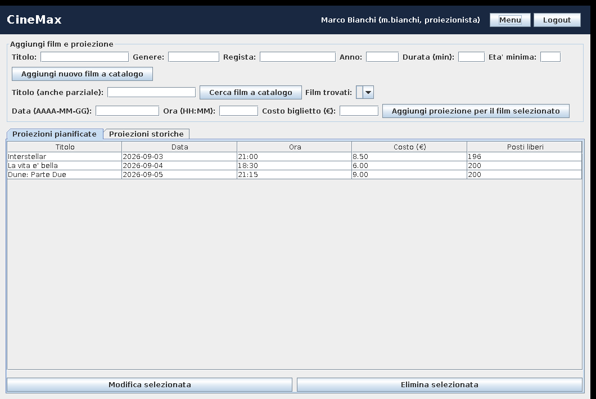

Dopo il login, un proiezionista vede questa schermata unica da cui gestisce l'intero palinsesto.

## 4.1 Aggiungere un nuovo film e una nuova proiezione

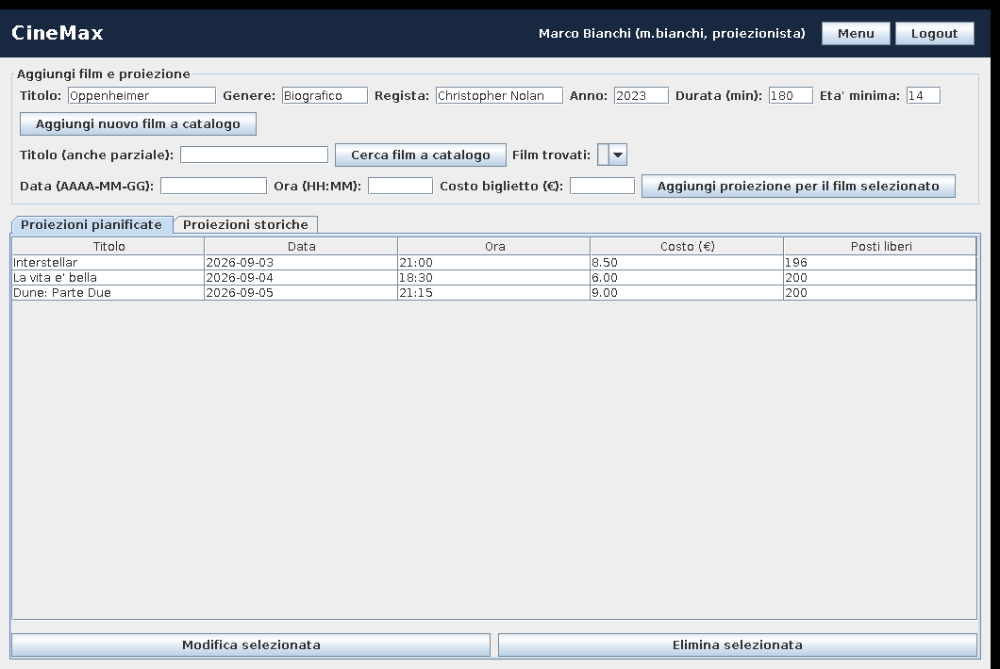

Nella parte alta della schermata si possono inserire i dati di un nuovo film (titolo, genere, regista, anno, durata in minuti, età minima) e premere **"Aggiungi nuovo film a catalogo"**. Se il film esiste già a catalogo, questo passaggio non è necessario.

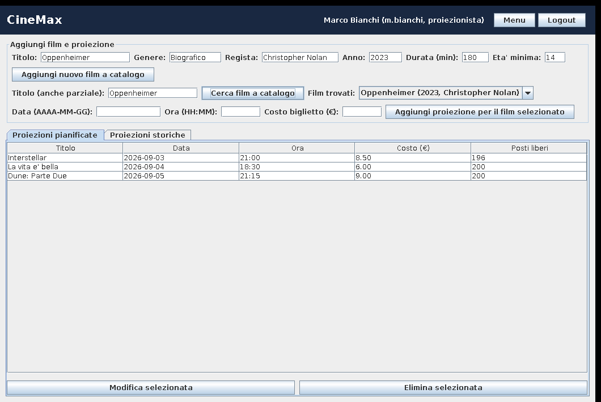

Per programmare una proiezione si cerca prima il film a catalogo per titolo (anche parziale) con **"Cerca film a catalogo"** e lo si seleziona dal menu a tendina "Film trovati". Poi si indicano data, ora e costo del biglietto per la nuova proiezione.

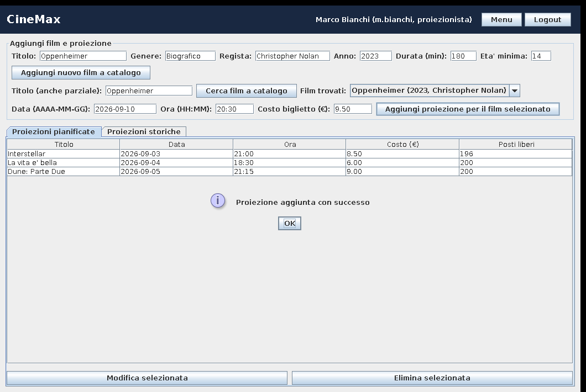

Premendo **"Aggiungi proiezione per il film selezionato"** la proiezione viene creata, a patto che non si sovrapponga a un'altra proiezione già esistente (unica sala disponibile): in tal caso l'applicazione lo segnala e la proiezione non viene creata.

## 4.2 Proiezioni pianificate e proiezioni storiche

Le due schede in basso permettono di consultare, separatamente, le **proiezioni pianificate** (con data successiva a quella odierna — visibili nello screenshot del §4, con i pulsanti "Modifica selezionata" ed "Elimina selezionata" per intervenire su una di esse) e le **proiezioni storiche** (con data precedente a quella odierna, quindi già avvenute):

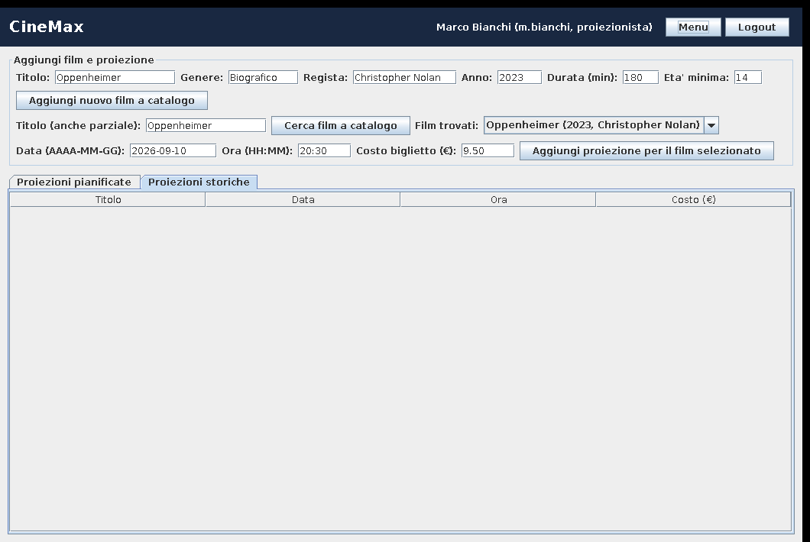

Una proiezione può essere modificata (cambio data, ora o costo) o eliminata solo se **non ha ancora nessuna prenotazione associata**: è una regola imposta sia dall'applicazione sia, a livello più profondo, da un vincolo del database (trigger), proprio per garantire che un cliente non si trovi mai con una prenotazione riferita a una proiezione cambiata o sparita a sua insaputa.

\newpage

# 5. Funzionalità del bigliettaio (login necessario)

## 5.1 Prenotazioni della giornata

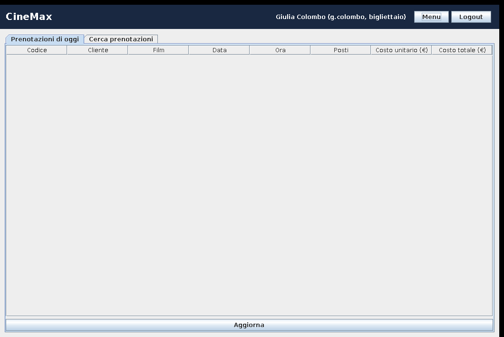

Dopo il login, il bigliettaio vede subito l'elenco delle prenotazioni relative alle proiezioni **della data odierna**, utile per il controllo all'ingresso in sala.

## 5.2 Cercare una prenotazione

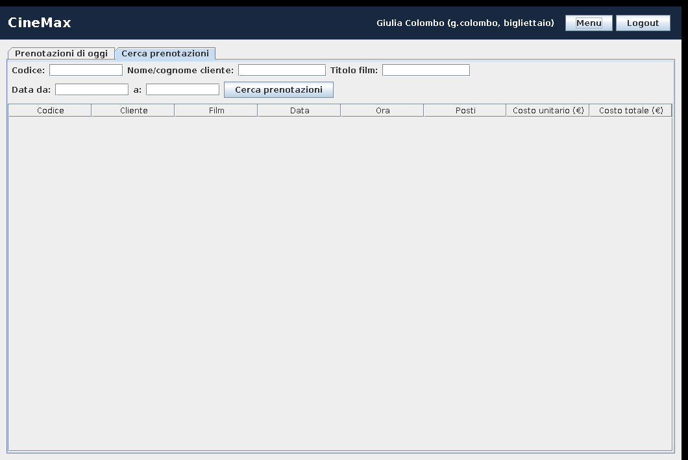

Dalla scheda "Cerca prenotazioni" il bigliettaio può ritrovare qualunque prenotazione (anche non odierna) combinando diversi criteri: codice della prenotazione, nome/cognome del cliente, titolo del film (anche parziale) e intervallo di date.

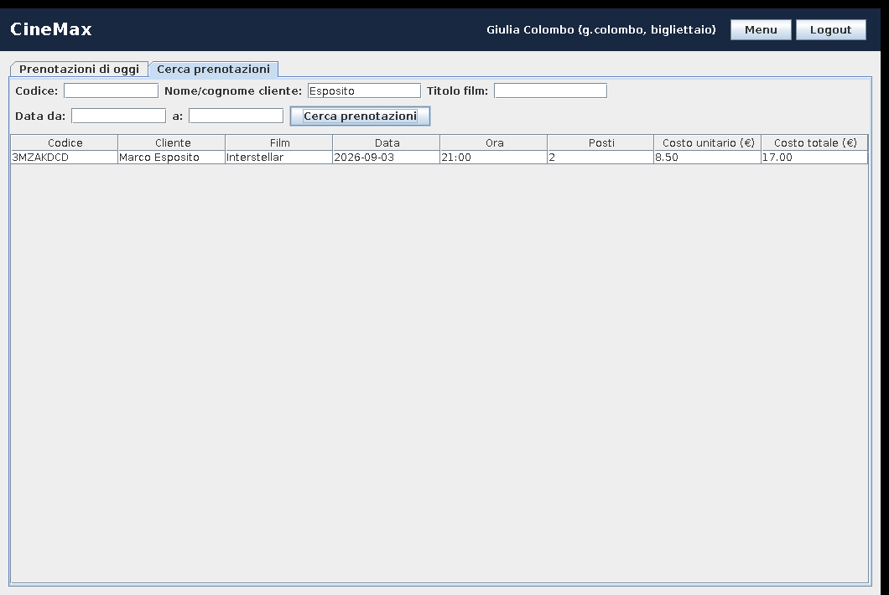

Per ogni prenotazione trovata vengono mostrati codice, cliente, film, data, ora, numero di posti, costo unitario del biglietto e costo totale.

\newpage

# 6. Messaggi di errore e gestione delle eccezioni

CineMax segnala sempre all'utente, con una finestra di dialogo, quando un'operazione non può essere eseguita: credenziali di login errate (§2.5), tentativo di disdire una prenotazione non ammessa dalla specifica (§3.3), tentativo di programmare una proiezione sovrapposta a un'altra (§4.1), tentativo di modificare/eliminare una proiezione con prenotazioni associate (§4.2), oppure un problema di connessione con il server. In tutti i casi l'applicazione resta sulla schermata corrente, senza perdere i dati già inseriti, cosicché l'utente possa correggere l'operazione e riprovare.
